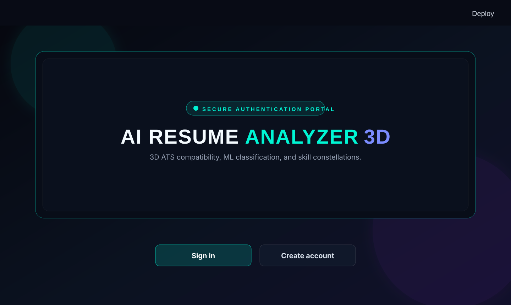

# 🌌 AI Resume Analyzer 3D with OCR & User Authentication

An AI-powered Resume Analyzer and ATS Optimization web application built with **Python, Streamlit, Machine Learning (Scikit-Learn), Natural Language Processing (NLP), WebGL/Three.js 3D Visualizations, PyPDF + Tesseract OCR Fallback, and User Authentication**.

---

## 🌟 Key Features

- **📄 Hybrid PDF Extraction (Native PyPDF + OCR Fallback)**:
  - Automatically extracts digital text from text-based PDFs.
  - Transparently falls back to **Tesseract OCR via pdf2image** at 300 DPI for scanned/image-based resumes.
  - Safe in-memory stream processing using `io.BytesIO` (no permanent file storage).
  - Limits OCR to the first 5 pages for high performance with helpful warnings on longer documents.
- **🔐 3D Login & User Authentication**:
  - **3D Quantum Vortex Portal** rendered with Three.js WebGL.
  - Strong password hashing with PBKDF2-HMAC-SHA256 and per-account lockout protection.
  - No built-in demo account or one-click bypass; each user registers their own credential set.
  - Session state tracking with user avatar, scan history counter, and sign-out.
- **⚡ Advanced Skill Extraction & Matching**: Comprehensive 500+ skills taxonomy with alias mapping (e.g. `k8s` -> `Kubernetes`, `react.js` -> `React`, `restful api` -> `REST API`).
- **🎯 4-Factor Weighted ATS Compatibility Score**:
  - Skill Match Coverage (50% weight)
  - Keyword & Semantic Similarity (20% weight)
  - Education & Experience Alignment (15% weight)
  - Resume Formatting & Health (15% weight)
- **🤖 Machine Learning Resume Category Prediction**: Multi-class classification model trained on 12 major career categories achieving **91.7% accuracy** with probability distribution confidence scoring.
- **🌌 Immersive 3D Visuals & WebGL Experiences**:
  - **3D Quantum Login Portal** (Three.js WebGL)
  - **3D Cyber Particle Terrain & Hero Header** (Three.js WebGL)
  - **3D Holographic ATS Compatibility Score Orb** with orbiting energy rings
  - **3D Interactive Skill Constellation** (360° draggable orbital node graph)
  - **3D Semantic Vector Space** (Plotly 3D scatter comparing Candidate Resume vs Target JD vs Reference Role Clusters)
  - **3D Capability Depth Mesh** across technological domains
- **💡 Actionable Improvement Recommendations**: Prioritized suggestions, STAR-method quantifiable impact tips, and ethical guidelines.
- **📥 Downloadable Full Audit Report**: Export comprehensive analysis in formatted plain text / markdown.
- **🧪 ML Model Studio**: Interactive Confusion Matrix, Accuracy / Precision / Recall / F1 cards, and live classification playground.

---

## 👀 What the website looks like

The app opens with a dark, glassmorphic 3D authentication portal and continues into an interactive resume analysis workspace with ATS scoring, skill matching, OCR extraction, recommendations, and visual analytics.

### 🌐 Live website

Try the deployed application here: [AI Resume Analyzer 3D](https://ai-resume-analysis-app-zdsge0.streamlit.app/)



Run the app locally to explore the complete experience:

```bash
streamlit run app.py
```

---

## 🏗️ Project Architecture

```
AI-Resume-Analyzer/
├── app.py                      # Main Streamlit Application (Auth, Upload & Dashboard)
├── auth.py                     # User Authentication & Session Security
├── resume_parser.py            # Hybrid PDF Parser (Native + OCR Fallback)
├── skill_match.py              # 500+ Skills Database & Extraction Engine
├── ats_score.py                # 4-Factor Weighted ATS Scoring Engine
├── model.py                    # ML Model Pipeline & Evaluation Studio
├── recommendations.py          # Context-Aware Resume Improvement Engine
├── create_sample_resumes.py    # Sample Resume Generator
│
├── data/
│   └── users.json              # User Accounts & Profiles Store
│
├── models/
│   ├── resume_classifier.pkl   # Serialized ML Classifier
│   └── tfidf_vectorizer.pkl    # Serialized TF-IDF Vectorizer
│
├── datasets/
│   └── resume_dataset.csv      # 12-Category Labeled Dataset
│
├── resumes/                    # Sample PDF & Text Resumes for instant testing
│   ├── sample_python_developer.pdf
│   ├── sample_data_scientist.pdf
│   └── sample_web_developer.pdf
│
├── utils/
│   ├── __init__.py
│   ├── text_processing.py      # NLP Tokenization & Section Segmentation
│   └── visuals_3d.py           # WebGL/Three.js & Plotly 3D Visual Engines
│
├── requirements.txt            # Python Dependency Specifications
├── packages.txt                # System packages for Streamlit Cloud (tesseract & poppler)
├── test_suite.py               # Comprehensive Automated Unit Tests
└── README.md                   # Documentation
```

---

## 🚀 Getting Started

### 1. Install Python Dependencies
```bash
pip install -r requirements.txt
```

### 2. Optional: Install OCR System Binaries (For Scanned PDFs)
*Note: Regular text-based PDFs work immediately out-of-the-box with standard Python packages. If you wish to process scanned/image-only PDFs:*

- **Windows**:
  1. Install Tesseract OCR: Download from [UB-Mannheim Tesseract](https://github.com/UB-Mannheim/tesseract/wiki) and install to default `C:\Program Files\Tesseract-OCR` or add to PATH.
  2. Install Poppler: Download from [poppler-windows releases](https://github.com/oschwartz10612/poppler-windows/releases) and add `bin/` folder to PATH or set `POPPLER_PATH`.
- **Ubuntu / Debian**:
  ```bash
  sudo apt-get update && sudo apt-get install -y tesseract-ocr poppler-utils
  ```
- **macOS**:
  ```bash
  brew install tesseract poppler
  ```
- **Streamlit Community Cloud**:
  Native packages are automatically installed from `packages.txt` (`tesseract-ocr` and `poppler-utils`).

### 3. Run the Streamlit Application
```bash
streamlit run app.py
```

Open your browser at `http://localhost:8501`.

### 🔑 Account Creation
- Create a personal account in the app via the registration tab.
- Login with the username or email you choose during registration.

---

## 🧪 Testing & Verification

Run the automated test suite:
```bash
python test_suite.py
```
